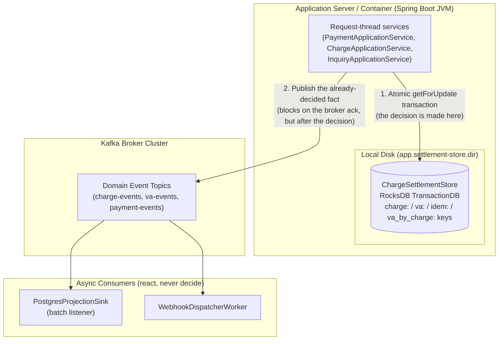
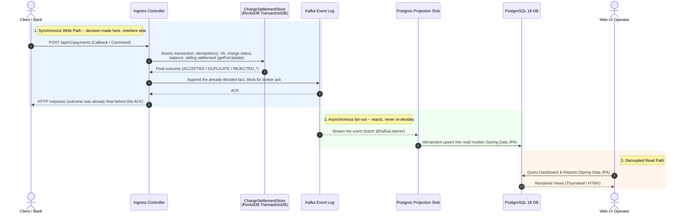
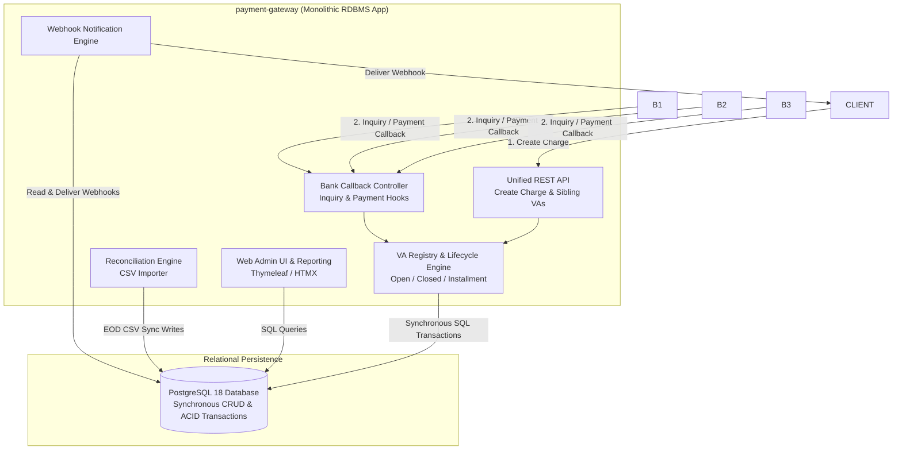
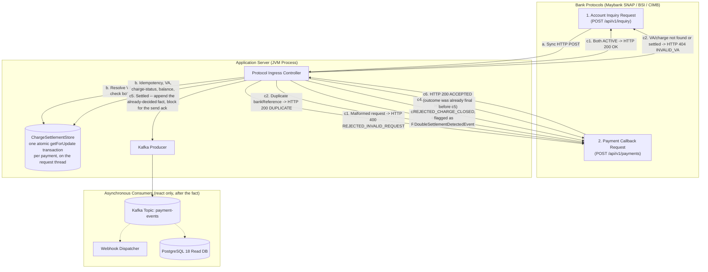
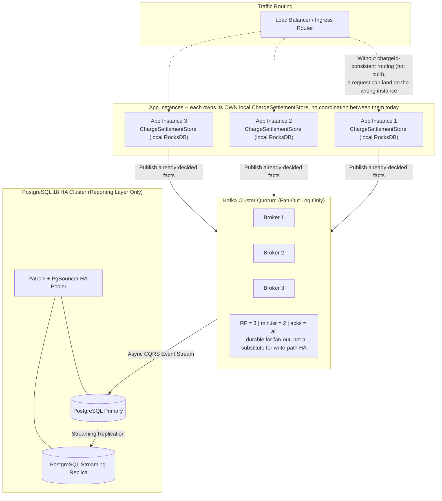
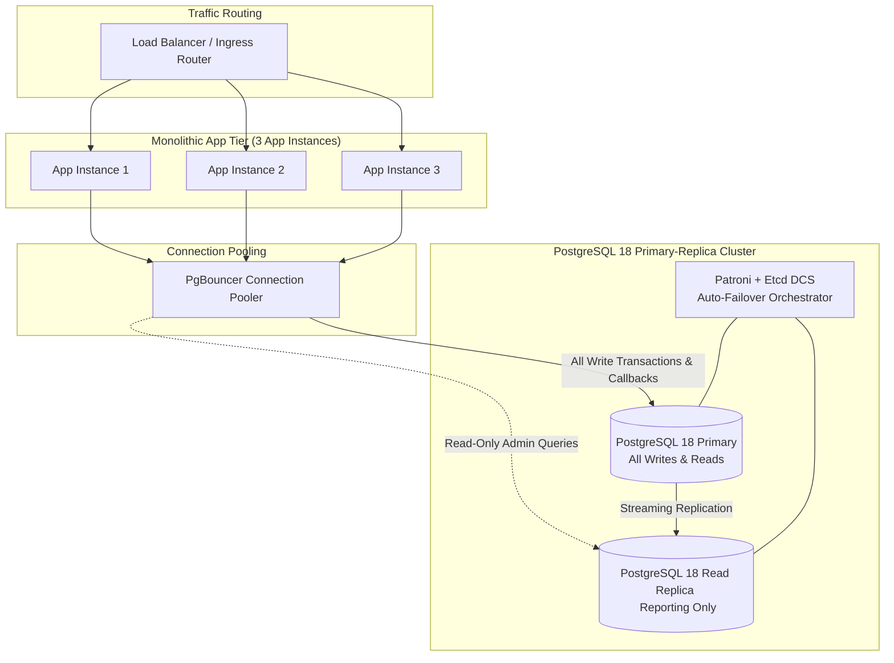

# payment-gateway-evtsrc

An event-sourced, self-hosted multi-bank Virtual Account (VA) payment gateway for Indonesian institutions. The synchronous write path is owned directly by the application — `ChargeSettlementStore`, a RocksDB `TransactionDB` — not by Kafka Streams. Apache Kafka is used as an event log purely for downstream fan-out: a PostgreSQL 18 CQRS read model and webhook delivery, neither of which the write path waits on to make a correctness decision.

For local development and starter environments, this repository runs a **single-node deployment** (1 App Instance, 1 Apache Kafka broker, 1 PostgreSQL 18 container) to maintain **1:1 infrastructure parity** with the single-node deployment of the relational [`payment-gateway`](https://github.com/artivisi/payment-gateway) implementation for direct benchmark comparison.

---

## 1. Problem & Architectural Motivation

Institutions collecting payments via Virtual Accounts (universities, hospitals, foundations) require high availability, low-latency callback validation, and single-debt guarantees across multiple bank VAs.

The original [`payment-gateway`](https://github.com/artivisi/payment-gateway) project uses a traditional relational database (PostgreSQL 18) for write transactions and read queries. In high-volume payment bursts, database lock contention (`SELECT FOR UPDATE`), shared connection pools, and IO spikes can degrade bank callback SLAs.

To evaluate a fully decoupled alternative, **`payment-gateway-evtsrc` implements an Event Sourcing & CQRS architecture**:
1. **`ChargeSettlementStore` is the write-path source of truth**: charge creation, VA registration, and payment settlement each resolve, validate, and apply as one atomic RocksDB transaction (`getForUpdate`, the same row-lock semantics a relational `SELECT FOR UPDATE` gives) directly on the request thread. There is no separate, later authoritative re-check — whatever the transaction returns is already final by the time the bank gets a response.
2. **Kafka is a fan-out log, not a decision point**: once a request-thread transaction has already decided the outcome, the resulting fact (`PaymentReceivedEvent`, `DoubleSettlementDetectedEvent`, etc.) is appended to Kafka so downstream consumers can react to it. Nothing reads these events back to make or revise a correctness decision.
3. **PostgreSQL 18 CQRS Reporting Sink (Read Path)**: an asynchronous batch `@KafkaListener` (`PostgresProjectionSink`) streams events from Kafka into PostgreSQL 18. The Web UI fetches reporting data, transaction history, audit logs, and reconciliation status from PostgreSQL via **Spring Data JPA** — entirely decoupled from the write path.

This is a correction of an earlier design (still visible in git history) where Kafka Streams owned three RocksDB state stores and the request thread only ran a read-only interactive query against them, then published an event for a separate Kafka Streams thread to apply later. That split left a race window: the request thread's optimistic read and the topology's later authoritative write could disagree, and by the time the topology caught the disagreement, the bank had already been told the request thread's — possibly wrong — answer. See `docs/benchmark-remediation-guideline.md`'s "Seventh gap" and "Eighth gap" for the incident this replaced, the fix, and how it was verified (a 50-real-thread concurrency test, not sequential event replay).

---

## 2. Feature List

### 2.1 Multi-Bank Virtual Account Collection (Unified API)
- **Single API integration** for client applications (e.g. academic systems, hospital management, or subledgers like `account-receivable`).
- **Bank-specific protocol adapters**:
  - Maybank (SNAP / REST)
  - BSI (proprietary REST / JSON)
  - CIMB (proprietary SOAP / XML)
- **VA Hosting Models**:
  - **Gateway-hosted (Model 1)**: Gateway resolves VA inquiries in real time against `ChargeSettlementStore` and receives payment callbacks.
  - **Bank-hosted (Model 2)**: Gateway registers VAs at banks upfront and handles payment callbacks.

### 2.2 Flexible Charge Types & Sibling Virtual Accounts
- **Open Charges**: Persistent, variable amount, accepts repeated payments, never reaches a terminal state.
- **Closed Charges**: Fixed amount, single payment, closes upon full settlement.
- **Installment Charges**: Multiple partial payments accumulating up to a target debt amount.
- **Sibling Virtual Accounts**: A single charge is payable through multiple bank VAs simultaneously.
- **Single-Debt Invariant**:
  - The first payment that settles a CLOSED charge (or completes an INSTALLMENT charge) marks the paying VA `PAID` and every other still-`ACTIVE` sibling `CANCELLED`, inside the same atomic transaction that made the settlement decision.
  - **Double-Settlement Discrepancy Prevention**: a payment against an already-settled charge is rejected and flagged (`DoubleSettlementDetectedEvent`) for out-of-band refund handling, never silently absorbed or double-credited.

### 2.3 `ChargeSettlementStore`: RocksDB Write Path & Kafka Fan-Out
- **`ChargeSettlementStore`**: a RocksDB `TransactionDB` owned directly by the application process — not a Kafka Streams state store, no changelog topic behind it. Its own key space is partitioned by prefix:
  - `charge:<chargeId>` — charge metadata, `cumulativePaid`, and status (`ACTIVE` / `PAID` / `CANCELLED`).
  - `va:<bankCode>_<vaNumber>` (plus a bank-agnostic `va:<vaNumber>` alias) — each VA's own `chargeId` and status. The VA that actually receives a settling payment becomes `PAID`; every other still-`ACTIVE` sibling becomes `CANCELLED`.
  - `idem:<bankCode>_<bankReference>` — blocks duplicate callback processing.
  - `va_by_charge:<chargeId>:<bankCode>_<vaNumber>` — an index letting a settlement transaction walk a charge's siblings without a full store scan.
- **One atomic transaction per payment**: idempotency check, VA resolution, the charge's terminal-status check, the balance update, and (when the charge settles) the sibling walk all happen inside a single `getForUpdate`-locked RocksDB transaction on the request thread. See `ChargeSettlementStore`'s own Javadoc for the full mechanics and its stated scale-out caveat.
- **Kafka event topics** (fan-out only — nothing reads these back to decide correctness):
  - `charge-events`: `ChargeCreatedEvent`, `ChargeCancelledEvent`
  - `va-events`: `SiblingVaRegisteredEvent`
  - `payment-events`: `PaymentReceivedEvent`, `DoubleSettlementDetectedEvent`
  - `reconciliation-events`, `webhook-events`: topics are provisioned (`KafkaTopicConfig`) but nothing currently publishes to them — reconciliation runs as a direct CSV-import call, and webhook delivery is driven off `payment-events` directly, not a dedicated `webhook-events` stream.

### 2.4 PostgreSQL 18 Projection Sink & Spring Data JPA (Read Path)
- **Asynchronous Projection Sink**: a batch `@KafkaListener` (`PostgresProjectionSink`, consumer group `payment-gateway-projection-sink`) processes domain events into idempotent upserts against the PostgreSQL 18 reporting schema.
- **Spring Data JPA Web UI**: Thymeleaf + HTMX operator dashboard queries PostgreSQL 18 via Spring Data JPA repositories for filtering, pagination, transaction search, and audit trails.

### 2.5 Reconciliation & Discrepancy Management
- End-of-Day (EOD) bank settlement CSV import processor (`ReconciliationProcessor`), invoked directly, not Kafka-driven.
- Cross-checks recorded payments in PostgreSQL against the imported settlement file.
- Flags unmatched credits, duplicate payments, and amount mismatches.

### 2.6 Resilient Webhook Delivery
- `WebhookDispatcherWorker`, an asynchronous `@KafkaListener` (consumer group `payment-gateway-webhook-dispatcher`) on `payment-events`, delivers signed webhooks to client applications.
- Exponential backoff retries with per-consumer isolation.

---

## 3. Architecture Design

### 3.1 Where State Actually Lives, vs. a Traditional RDBMS

| Dimension | This App's Write Path (`ChargeSettlementStore`) | Kafka Broker Cluster | Traditional RDBMS (`payment-gateway`) |
|---|---|---|---|
| **What runs here?** | Spring Boot JVM + embedded RocksDB C++ library (`rocksdbjni`), owned directly by the app — no Kafka Streams. | Apache Kafka broker daemon (KRaft). | Monolithic Spring Boot app + PostgreSQL 18. |
| **Where is state stored?** | Local disk of the app container (`app.settlement-store.dir`). | Kafka segment logs on broker disk. | PostgreSQL data tables on DB disk. |
| **Primary purpose** | Atomic decision-making for the write path: idempotency, VA resolution, charge status, balance, sibling settlement. | Immutable event log for downstream fan-out (Postgres projection, webhooks). | ACID transactions, state storage, and read queries (shared DB). |
| **Network hop on callback** | Zero — the decision is made against the local RocksDB directory. | One append, blocked on for the broker ack, but *after* the decision is already final. | 1–4 network round-trips (RDBMS SQL statements inside one transaction). |
| **What happens on app crash?** | If `app.settlement-store.dir` is a persistent volume, the directory survives a restart intact. If it isn't, the store comes back empty; `PostgresInitialStateSeeder` can re-seed from the Postgres projection, but anything created or paid after the last projection would be lost from the write-path store specifically. There is currently **no automatic changelog-backed recovery** — see §4.4. | Unaffected; keeps serving topics. | App restarts; DB remains the single point of failure if unclustered. |

---

### 3.2 Storage Strategy & Location (Where Everything Resides)

| Store / Component | Storage Engine | Purpose & Access Pattern |
|---|---|---|
| **Event log (fan-out)** | Apache Kafka | Immutable record of already-decided facts, for the Postgres projection and webhook delivery. |
| **`ChargeSettlementStore`** | RocksDB `TransactionDB` (`rocksdbjni`) | The write path's actual source of truth — charge, VA, idempotency, and sibling-index records, all in one directly-owned store (see §2.3's key layout). |
| **Reporting Read DB** | PostgreSQL 18 | CQRS projection sink storing relational read models for the Web UI, accessed via Spring Data JPA. |



#### Key Storage Principles
- **`ChargeSettlementStore` resides on the application node**: RocksDB runs inside the JVM process via JNI, persisting to the local disk of the app container. Kafka does not host or run it, and there is no Kafka Streams changelog topic backing it.
- **The decision is made locally, before Kafka is touched**: idempotency, VA resolution, charge status, balance update, and sibling settlement all happen in one `getForUpdate` transaction against the local directory. Kafka is only appended to afterward, to broadcast that already-final decision.
- **No changelog-backed recovery today**: durability of `ChargeSettlementStore` depends entirely on `app.settlement-store.dir` being a persistent, backed-up volume — see §4.4 for what this means for HA.

---

### 3.3 Execution & Data Flow (Sequence Diagrams)

#### 1. Event-Sourced & CQRS Architecture Flow (`payment-gateway-evtsrc`)

The decision is made synchronously against the local RocksDB transaction; Kafka is appended to afterward purely to broadcast it, and PostgreSQL projection happens asynchronously in parallel with nothing else.



#### 2. Traditional RDBMS Architecture Flow (Original `payment-gateway`)

In the relational implementation, the bank callback thread executes multiple sequential database queries and writes inside a single blocking ACID transaction before responding to the bank.


#### Key Architecture Trade-Off Comparison

| Metric / Dimension | Traditional RDBMS (`payment-gateway`) | Event-Sourced CQRS (`payment-gateway-evtsrc`) |
|---|---|---|
| **Hot-path response time** | Low-single-digit ms typically; degrades under sustained hot-row contention (see §5's linked report for a measured knee). | Low-single-digit ms median, single-digit-ms p99, no degradation observed at the same load — measured, not aspirational; see §5. Neither system is sub-millisecond end-to-end once checksum verification and the network round-trip are counted. |
| **Write-read coupling** | Shared DB connections & IO contention. | Decoupled: writes hit local RocksDB; reads hit Postgres, fed asynchronously. |
| **Resilience to DB downtime** | Bank callbacks fail if Postgres is down. | Bank callbacks still succeed (the decision never touches Postgres); the Postgres read model falls behind and catches up once it's back. |
| **Auditability & replay** | Destructive state updates (`UPDATE`). | Kafka event replay fully rebuilds the **Postgres read model** from genesis (§4.5) — it does **not** rebuild `ChargeSettlementStore` itself, since that store has no changelog behind it (see §3.1, §4.4). |

---

### 3.4 System Architecture Comparison

#### 1. Event-Sourced CQRS System Architecture (`payment-gateway-evtsrc`)

`ChargeSettlementStore` is where every write-path decision is made, synchronously, on the request thread. Kafka fans the already-decided fact out to the Postgres projection sink and the webhook dispatcher; neither is on the decision path.

```mermaid
flowchart TD
    subgraph Clients & Banks
        CLIENT[Client Application / Subledger<br/>e.g. account-receivable]
        B1[Maybank<br/>SNAP / REST]
        B2[BSI<br/>REST / JSON]
        B3[CIMB<br/>SOAP / XML]
    end

    subgraph Ingress ["Ingress Controllers & Application Services"]
        API[Unified REST API<br/>Create Charge & Sibling VAs]
        CALLBACK[Bank Callback Controllers<br/>Inquiry & Payment Hooks]
        SVC[ChargeApplicationService / PaymentApplicationService /<br/>InquiryApplicationService]
    end

    subgraph Settlement ["Synchronous Write Path (App Instance, JVM Process)"]
        STORE[("ChargeSettlementStore<br/>RocksDB TransactionDB -- one atomic<br/>transaction decides the outcome")]
    end

    subgraph Event_Log ["Kafka: Fan-Out Only"]
        KAFKA[Apache Kafka Cluster<br/>Already-decided facts]
    end

    subgraph Async_Consumers ["Asynchronous Consumers (react, never decide)"]
        PROJ_SINK[PostgresProjectionSink<br/>batch @KafkaListener]
        WH_WORKER[WebhookDispatcherWorker<br/>@KafkaListener on payment-events]
        RECON_ENGINE[ReconciliationProcessor<br/>direct CSV import, not Kafka-driven]
    end

    subgraph Read_Models ["Read Models & Persistence"]
        PG[(PostgreSQL 18<br/>Reporting Read DB)]
        ADMIN[Web Admin UI & Reporting<br/>Thymeleaf / HTMX + Spring Data JPA]
    end

    CLIENT -->|1. Create Charge Request| API
    B1 -->|2. Inquiry / Payment Callback| CALLBACK
    B2 -->|2. Inquiry / Payment Callback| CALLBACK
    B3 -->|2. Inquiry / Payment Callback| CALLBACK

    API --> SVC
    CALLBACK --> SVC

    SVC -->|3. Atomic transaction -- outcome decided here| STORE
    STORE -->|4. Final outcome| SVC
    SVC -->|5. HTTP response, already final| CALLBACK

    SVC -->|6. Publish already-decided fact| KAFKA

    KAFKA -->|7. Stream events| PROJ_SINK
    PROJ_SINK -->|8. Idempotent upsert| PG

    KAFKA -->|Stream payment-events| WH_WORKER
    WH_WORKER -->|9. Deliver webhook| CLIENT

    RECON_ENGINE -->|Upload EOD CSV & match| PG

    ADMIN -->|10. Spring Data JPA queries| PG
```

#### 2. Traditional RDBMS System Architecture (Original `payment-gateway`)

Traditional monolithic architecture where all core modules, callback controllers, webhooks, and admin UI query and write directly to a single shared PostgreSQL database using synchronous ACID transactions.



---

### 3.5 Synchronous HTTP Protocol Adapters & Hot-Path Pre-Validation

Indonesian banking protocols (Maybank SNAP, BSI, CIMB) mandate **strict synchronous HTTP responses**. The gateway must never return an intermediate "pending" state to the bank. This section describes the validation actually implemented in `PaymentApplicationService.processPayment` / `InquiryApplicationService.inquireAccount` / `ChargeSettlementStore.applyPayment`, executed as one atomic RocksDB transaction on the HTTP request thread — not a design aspiration.

1. **Account Inquiry** (`POST /api/v1/inquiry`, `/api/inquiry`, `/api/bank/maybank/v1.0/transfer-va/inquiry`): responds **`HTTP 200 OK`** with customer name and outstanding amount if the VA resolves, its own status is `ACTIVE`, *and* its charge's status is `ACTIVE`; **`HTTP 404`** (`INVALID_VA` / `INVALID_CHARGE`) otherwise — including a settled VA (paid or cancelled), which correctly stops resolving once its charge settles.
2. **Payment Callback** (`POST /api/v1/payments`, `/api/payments`, `/api/bank/maybank/v1.0/transfer-va/payment`; BSI's proprietary shape is served separately at `/api/bank/bsi`, see below): the outcome vocabulary is the `PaymentOutcome` enum (`ACCEPTED`, `DUPLICATE`, `REJECTED_INVALID_VA`, `REJECTED_CHARGE_CLOSED`, `REJECTED_INVALID_AMOUNT`, `REJECTED_INVALID_REQUEST`), mapped to HTTP status by `BankCallbackController`:
   - `ACCEPTED`, `DUPLICATE` → `200 OK`
   - `REJECTED_INVALID_VA` → `404 Not Found`
   - `REJECTED_CHARGE_CLOSED`, `REJECTED_INVALID_AMOUNT`, `REJECTED_INVALID_REQUEST` → `400 Bad Request`



#### Detailed Execution Mechanics

1. **Account Inquiry**: `InquiryApplicationService.inquireAccount` resolves `bankCode_vaNumber` via `ChargeSettlementStore.resolveVa`, rejecting (`404 INVALID_VA`) if the VA doesn't resolve or its own status isn't `ACTIVE`; otherwise loads the charge and rejects (`404 INVALID_VA`) if the charge's own status isn't `ACTIVE` either; otherwise returns `200 OK` with the outstanding amount.

2. **Payment Callback Pre-Validation** (`PaymentApplicationService.processPayment` → `ChargeSettlementStore.applyPayment`, all of steps (b)–(e) below inside **one** RocksDB transaction, in this exact order — each step short-circuits the rest):
   1. **Field validation** (before the transaction): `bankCode`, `vaNumber`, `bankReference` non-blank, `amount` present and `> 0`, `paymentTimestamp` present. Any violation → `REJECTED_INVALID_REQUEST` (`400`). No field is defaulted or substituted — a missing `paymentTimestamp` is rejected, never set to `now()`.
   2. **Idempotency**: `getForUpdate` on `idem:<bankCode>_<bankReference>`. A hit returns `DUPLICATE` (`200`) with the originally recorded `eventId`/`chargeId` — no second event is appended, and the transaction rolls back.
   3. **VA resolution**: plain read of `va:<bankCode>_<vaNumber>` (or the bank-agnostic alias). A miss returns `REJECTED_INVALID_VA` (`404`). The caller does not supply `chargeId` — the gateway resolves it from the VA record.
   4. **Charge terminal-status check**: `getForUpdate` on `charge:<chargeId>` — this is the row lock: no other transaction touching this same `chargeId` can proceed until this one commits or rolls back. If the charge's status is already `PAID` or `CANCELLED`, the payment is rejected as `REJECTED_CHARGE_CLOSED` (`400`) **and** a `DoubleSettlementDetectedEvent` is recorded in the same transaction, flagging the attempted overpayment rather than silently dropping it.
   5. Otherwise, `cumulativePaid` is updated; if this payment settles the charge (CLOSED, or an INSTALLMENT reaching its total), the charge is marked `PAID` and the sibling walk runs (§2.3) in the same transaction; the transaction commits and `ACCEPTED` (`200`) is returned.

3. **No residual race for a single instance**: unlike the earlier Kafka-Streams-based design, there is no gap left between "checked" and "applied" for a second request to land in — the entire lookup-validate-apply sequence is one `getForUpdate`-locked transaction, so two concurrent callbacks against the *same* `chargeId` are fully serialized by RocksDB itself, not by a later asynchronous re-check. Verified two ways: `BankCallbackControllerIntegrationTest.testPaymentCallback_ConcurrentFullSettlement_ExactlyOneApplied` (an HTTP-level concurrent-settlement test) and `ConcurrentPaymentSettlementIntegrationTest` (50 real concurrent threads against one freshly-created `CLOSED` charge — exactly one accepted, the other 49 correctly flagged, `cumulativePaid` never double-counted). The one caveat this *doesn't* cover: multiple **instances** each running their own local `ChargeSettlementStore` — see §4.4.

4. **Asynchronous fan-out**: after the bank receives its synchronous response, `WebhookDispatcherWorker` and `PostgresProjectionSink` consume `payment-events` (and the other domain topics) independently to deliver client webhooks and update the PostgreSQL read model. Neither is on the request path, and neither can revise the decision already made.

#### 3.5.1 Internal Uniform Correlation ID vs. External Bank Correlation ID Mapping

To maintain strict architectural consistency across heterogeneous bank protocols while preserving full auditability, `payment-gateway-evtsrc` separates correlation identifiers into two distinct tiers:

1. **Internal Uniform Correlation ID (`correlationId` / `eventId`)**:
   - **Format**: Standardized internal `UUID` (e.g. `UUID.randomUUID()`) generated by the gateway.
   - **Purpose**: Guarantees a consistent, time-ordered primary key across all internal application logs, Kafka event keys, `ChargeSettlementStore` records, and PostgreSQL CQRS projection tables, regardless of which bank sent the callback.
2. **External Bank Correlation ID (`externalCorrelationId` / `bankReference`)**:
   - **Format**: Raw string provided by the bank or protocol adapter (e.g. SNAP `X-EXTERNAL-ID`, REST `X-Correlation-ID`, or `bankReference`). Formats vary widely across banks (alphanumeric, variable length, or missing).
   - **Purpose**: Maps internal events back to the bank's external reference for audit inquiries, EOD CSV settlement matching, and outbound client webhook headers (`X-Correlation-ID`).

#### Propagation Lifecycle
- **Ingress Extraction**: Controller receives callback, generates internal `eventId` (UUID), and extracts `externalCorrelationId` from request headers/payload.
- **Kafka Event Enrichment**: `PaymentReceivedEvent` contains both `eventId` (internal UUID) and `externalCorrelationId` (bank reference).
- **`ChargeSettlementStore` Idempotency**: the `idem:` key namespace indexes transactions by `externalCorrelationId` / `bankReference` to block duplicate bank callbacks within the same atomic transaction.
- **PostgreSQL CQRS Projection**: Read models store both `event_id` (UUID primary key) and `external_correlation_id`, allowing operators to search dashboard logs by either internal UUID or bank reference.
- **Outbound Webhook Delivery**: `WebhookDispatcherWorker` attaches `X-Correlation-ID: <externalCorrelationId>` when delivering HTTP POST notifications to merchant subledgers (e.g. `account-receivable`).

#### 3.5.2 Monolithic In-Process State vs. Distributed Microservices Correlation

A key architectural design question when building payment gateways is whether to use **In-Process Synchronous Validation** or **Deferred Synchronous Correlation**:

1. **Single-Module Monolithic Layout with Local RocksDB (`payment-gateway-evtsrc`)**:
   - **Mechanism**: the ingress controllers, application services, and `ChargeSettlementStore` live in the same Spring Boot application process.
   - **Validation**: when a bank callback (`POST /api/v1/payments`) arrives, the HTTP request thread runs one atomic RocksDB transaction against `ChargeSettlementStore` directly.
   - **Result**: the controller accepts or rejects the callback **in-process before returning**, appends the already-decided fact to Kafka, and returns the HTTP response directly on the request thread. **No `CompletableFuture` or broadcast consumer groups are required.**

2. **Distributed Microservices Layout (e.g. Ingress Gateway + Independent Bank Host Adapters / Clearing Core Microservices)**:
   - **Mechanism**: the Ingress Gateway is decoupled into a thin edge microservice that does *not* host state, while downstream business logic (e.g. fraud screening, core settlement engine, or dedicated per-bank host adapter microservices) runs in separate application containers.
   - **Validation**: when a request arrives, the Ingress Gateway microservice cannot validate state locally. It must publish a command event to Kafka (e.g. `bank-request-topic`) and **defer the HTTP response**.
   - **Result**: the HTTP request thread registers a `CompletableFuture<Response>` keyed by correlation ID (`correlationId` / `bankReference`) and blocks on `future.get(timeout)`. Each Ingress Gateway replica runs a broadcast consumer group (`ingress-gateway-${instance-id}`) listening on `bank-response-topic` to correlate the outcome back to the waiting HTTP thread.

#### Architectural Trade-off Comparison

| Metric / Aspect | Single-Module Monolith (`payment-gateway-evtsrc`, as built) | Distributed Microservices Layout (not built here) |
|---|---|---|
| **State Location** | `ChargeSettlementStore`, embedded RocksDB on the local App node. | External microservices / database stores across network. |
| **Validation Point** | **In-Process** (HTTP thread runs the RocksDB transaction directly). | **Out-of-Process** (Ingress waits for a downstream Kafka-correlated event). |
| **Correlation Strategy** | Standard event logging (`correlationId` header) — no deferred correlation needed. | Deferred `CompletableFuture` + broadcast consumer groups. |
| **Operational Complexity** | Low (single deployment artifact, no fan-out network traffic on the decision path). | High (per-instance consumer groups, network traffic amplification). |

### 3.6 Initial Deployment Seeding for Pre-Existing Virtual Accounts & Charges

When deploying `payment-gateway-evtsrc` into an existing enterprise environment with pre-existing charges and bank VAs, initial state can be loaded directly from a **PostgreSQL database dump**, via `PostgresInitialStateSeeder`:

1. **Database Dump Import**: DBAs restore legacy tables directly into PostgreSQL tables (`charge_projection`, `sibling_va_projection`).
2. **On-Startup Registration**: When `app.migration.seed-from-postgres=true` is set and the settlement store is empty, `PostgresInitialStateSeeder` runs on application startup:
   - Reads active pre-existing charges and Virtual Accounts from PostgreSQL.
   - Registers each one directly into `ChargeSettlementStore`, synchronously, so they are resolvable via inquiry/payment the instant seeding finishes.
   - Also emits the equivalent `ChargeCreatedEvent`/`SiblingVaRegisteredEvent` records to `charge-events`/`va-events`, purely so `PostgresProjectionSink` builds the matching read model.
3. **Idempotent re-run guard, not changelog-backed durability**: `ChargeSettlementStore` is a plain, directly-owned RocksDB directory with no Kafka Streams changelog behind it. If `app.settlement-store.dir` is a persistent volume, the directory survives a restart and the seeder detects existing state and skips re-seeding. If it isn't, the store comes back empty and the seeder runs again on the next restart — give it a persistent volume for a real migration.

---

## 4. Production Sizing, High Availability & Operational Scalability

### 4.1 Comparative Production Expectations & Scaling Mechanics

| Operational Dimension | Traditional RDBMS (`payment-gateway`) | Event-Sourced CQRS (`payment-gateway-evtsrc`) |
|---|---|---|
| **Scaling mechanism** | **Vertical Scaling (Scale-Up)**: increase CPU, RAM, and NVMe IOPS on the primary PostgreSQL DB. Read replicas offload read queries only. | **Write path: not built yet.** `ChargeSettlementStore` is a per-instance local store; running more than one instance today just gives each instance its own disjoint set of charges, with no coordination. A real scale-out would need consistent chargeId-based request routing (§4.4). **Read/fan-out path: horizontal today** — `PostgresProjectionSink`/`WebhookDispatcherWorker` consumer concurrency scales with Kafka partition count. |
| **Write throughput bottleneck** | Single primary DB writer: all bank callbacks hit the one primary database instance for `SELECT FOR UPDATE` and `COMMIT`. | Single JVM instance's `ChargeSettlementStore` throughput. Measured: ~960 req/s sustained with room to spare (peak VU usage stayed well under the 100-VU pre-allocation across a 50→2,000 TPS ramp) — see §5. |
| **Failover recovery** | 10–30 seconds (DB failover via Patroni/PgBouncer with connection re-establishment). | **No automatic failover exists today.** Recovery depends on `app.settlement-store.dir` being a persistent volume (instance restarts with state intact) or a manual `PostgresInitialStateSeeder` re-seed from the Postgres projection (lossy for anything not yet projected) — see §4.4. |
| **Operational complexity** | Low: standard Spring Boot CRUD app + single PostgreSQL DB cluster. | Moderate: Kafka cluster + a directly-owned RocksDB directory needing its own backup/persistence story + async projection/webhook consumers. No Kafka Streams cluster/topology to operate. |

---

### 4.2 Scalability Limitations & Bottlenecks

#### 1. Traditional RDBMS Approach Limitations (`payment-gateway`)
- **Primary Database Write Bottleneck**: while read replicas offload read traffic, all bank callback writes (`INSERT INTO payment`, `UPDATE charge SET balance = ...`) must execute on the single primary PostgreSQL writer node inside a synchronous ACID transaction. Under heavy enrollment-scale bursts (e.g. tuition payment deadline), row-level locks (`SELECT FOR UPDATE`) cause thread pool exhaustion and bank callback timeouts (`504 Gateway Timeout`).
- **I/O Contention During Reconciliation**: End-of-Day (EOD) CSV reconciliation imports execute heavy batch writes and table scans on the primary database, consuming disk IOPS and CPU, directly degrading callback SLA for real-time payments.
- **Connection Pool Exhaustion**: high concurrent HTTP callback requests rapidly consume available PgBouncer / HikariCP connection pools, risking connection rejection under traffic spikes.
- **Destructive State Updates**: `UPDATE` queries overwrite past state, destroying historical timeline auditability unless complex audit tables and database triggers are maintained.

#### 2. Event-Sourced CQRS Approach Limitations (`payment-gateway-evtsrc`)
- **Write path is single-instance only, today**: `ChargeSettlementStore` is a per-instance local RocksDB directory. Running a second instance does not add write capacity or resilience — it just owns a disjoint set of charges with no coordination between the two. Real horizontal write scale-out needs consistent chargeId-based routing to the instance owning that charge (analogous to Kafka Streams' `queryMetadataForKey()` pattern) — not yet built; see §4.4.
- **Read/fan-out parallelism is partition-count bounded**: `PostgresProjectionSink` and `WebhookDispatcherWorker` are batch `@KafkaListener`s whose consumer concurrency is capped by topic partition count (`spring.kafka.listener.concurrency`, driven by `app.kafka.partitions`). Raising this after topics already exist requires a partition-count migration.
- **Storage Footprint Amplification**: data lives in three places — immutable Kafka topic segment files, the local RocksDB directory on each app instance, and relational projection tables in PostgreSQL 18.
- **Eventual Consistency & Projection Lag**: there is an inherent lag between Kafka event emission and PostgreSQL table update. `PostgresProjectionSink` exposes it live at `GET /api/admin/debug/projection-lag`; under the current benchmark load (§5) it stays in the single-digit-millisecond range throughout a full ramp, not zero.
- **Off-Heap C++ Native Memory Management**: RocksDB operates outside the JVM heap. Improper memory configuration (block cache, memtable bounds) can cause the OS OOM-killer to terminate application containers unexpectedly under heavy write pressure.
- **No changelog-backed recovery**: because `ChargeSettlementStore` isn't a Kafka Streams state store, there is no automatic re-hydration from a changelog topic if its local directory is lost — see §4.4.

---

### 4.3 Kafka Partition Count: What It Actually Governs Today

All Kafka topics use a co-partitioned key strategy (`charge_id`) for future routing potential, but today partition count governs one thing concretely: **consumer concurrency for the async fan-out**, not the write path (which doesn't use Kafka Streams or partitioned local state at all anymore).

#### 1. What partition count actually controls right now
- **`PostgresProjectionSink` / `WebhookDispatcherWorker` throughput**: both are batch `@KafkaListener`s with `concurrency = app.kafka.partitions` (`spring.kafka.listener.concurrency`). More partitions → more concurrent consumer threads → more headroom before projection lag or webhook delivery lag grows under load.
- **A precondition for future write-path scale-out**: if/when consistent chargeId-based request routing is built (§4.4), partition count would also cap how many `ChargeSettlementStore`-owning instances could exist, the same way it would for a Kafka Streams deployment. Not yet relevant, since that routing doesn't exist yet.

#### 2. Metrics relevant to sizing today
1. **Target peak throughput (TPS)**: drives how much consumer concurrency the projection sink/webhook dispatcher need to avoid growing lag.
2. **Planned app container nodes** (once write-path scale-out is built): would determine how partitions map to instances.
3. **Divisibility factor**: a partition count divisible by likely instance counts ($1, 2, 3, 4, 6, 12$) keeps future scale-out even.

#### 3. Recommended Partition Sizing Matrix

| Scale Tier | Target Peak Throughput | Recommended Partitions | Notes |
|---|---|---|---|
| **Starter / Development** | $<500\text{ TPS}$ | **6 Partitions** (current default) | 1:1 infrastructure parity with the single-node RDBMS baseline. |
| **Production Baseline** | $1,000\text{–}3,000\text{ TPS}$ | **12 Partitions** | Divisible by 1, 2, 3, 4, 6, 12 — headroom for the fan-out consumers, and for instance counts if write-path routing is later built. |
| **High-Scale Enterprise** | $5,000\text{–}10,000+\text{ TPS}$ | **24 Partitions** | More fan-out consumer parallelism; still doesn't help write-path scale-out without the routing layer in §4.4. |

#### 4. Current Implementation Status

Topics are created explicitly by `KafkaTopicConfig` (`NewTopic` beans for `charge-events`, `va-events`, `payment-events`, `reconciliation-events`, `webhook-events`), not left to Kafka's auto-creation default of 1 partition. Partition count is the single property `app.kafka.partitions` (default **6**, matching the Starter tier above), `replicationFactor` **1**, and it also drives `spring.kafka.listener.concurrency` for both the projection sink's and webhook dispatcher's batch listeners. There is no `spring.kafka.streams.*` configuration at all — Kafka Streams was removed entirely (see §1). No throughput numbers here reflect an untested configuration; §5 is the actual measured benchmark.

---

### 4.4 High Availability — What Exists Today, and What Would Need Building

#### 1. Event-Sourced CQRS (`payment-gateway-evtsrc`) — honest current state

There is **no multi-instance HA story for the write path today**. `ChargeSettlementStore` is a local RocksDB directory owned by one JVM instance, with no changelog topic, no standby replica, and no cross-instance coordination. This is a deliberate trade-off of the current design (see `ChargeSettlementStore`'s own Javadoc), not an oversight — it's what makes the write path a single, zero-Kafka-round-trip atomic transaction instead of a distributed one.

What recovery looks like today:
- **Instance restart with an intact volume**: `app.settlement-store.dir` on a persistent volume survives the restart; the app comes back with all state intact, no re-hydration needed.
- **Instance restart with an ephemeral volume, or a lost disk**: the local store comes back empty. `PostgresInitialStateSeeder` (§3.6) can re-seed from the Postgres projection, but anything created or paid after the last successful Postgres projection is lost from the write-path store specifically — a real gap, not a theoretical one.
- **Postgres itself failing**: unaffected on the write path. Bank callbacks keep succeeding because the decision never touches Postgres; the read model just falls behind and catches up once Postgres is back.

What multi-instance write-path HA would require (not yet built):
1. **Consistent chargeId-based request routing** to the one instance that owns a given charge's local store — the same problem a Kafka Streams deployment solves with `queryMetadataForKey()`-style routing.
2. **A real replication or backup strategy** for each instance's RocksDB directory, since there's no changelog fallback. Options include periodic snapshot shipping, a replicated block device, or accepting `PostgresInitialStateSeeder`'s lossy-since-last-projection re-seed as the recovery plan.
3. **Kafka's own durability** (`replication.factor=3`, `acks=all`, `min.insync.replicas=2`) still matters for the *fan-out* log — it gives RPO=0 for the Postgres projection and webhook delivery, independent of whatever the write-path HA story ends up being. This is the one piece of the diagram below that's still accurate as drawn.



---

#### 2. Traditional RDBMS HA Topology (Original `payment-gateway`)

For high-availability in the traditional relational deployment, all app instances connect to a primary database cluster managed by connection poolers:



##### RDBMS HA Mechanics
- **Single Primary Writer**: all 3 application instances write to the single primary PostgreSQL 18 database through PgBouncer.
- **Failover SLA (RTO 10–30s)**: if the primary DB node fails, Patroni promotes the read replica to primary and re-routes PgBouncer connections. During this window, all incoming bank callbacks fail or time out.
- **Vertical Bottleneck**: increasing bank callback throughput requires scaling up the primary DB machine's CPU, RAM, and NVMe IOPS. Adding app instances does not increase write capacity.

---

### 4.5 Event Stream Replay & Projection Rebuild Runbook

One benefit of Event Sourcing that survives the rearchitecture intact: the PostgreSQL reporting database can be wiped and rebuilt from genesis, purely from the Kafka event log. (This rebuilds the **read model** only — it does not, and cannot, rebuild `ChargeSettlementStore`'s own write-path state; see §4.4.)

1. **Stop Projection Sink Consumer**: pause the `payment-gateway-projection-sink` consumer group.
2. **Apply Flyway Schema Migration**: truncate or drop/recreate PostgreSQL projection tables (`charge_projection`, `payment_projection`, `reconciliation_projection`).
3. **Reset Consumer Group Offset**:
   ```bash
   kafka-consumer-groups --bootstrap-server kafka:9092 \
     --group payment-gateway-projection-sink \
     --reset-offsets --to-earliest --execute --topic charge-events,payment-events,va-events
   ```
4. **Restart Projection Sink**: the consumer group replays all events from `offset 0` into PostgreSQL. `GET /api/admin/debug/projection-lag` drops back toward zero as it catches up.

---

## 5. Performance Benchmark & Comparison

Both repositories are benchmarked through the identical real BSI proprietary adapter workload
(`POST /api/bank/bsi`, full SHA-1 checksum, `scenarios/suite-bsi.js` here / `scenarios/suite-rdbms.js`
on the RDBMS side), a `ramping-arrival-rate` profile from 50 to 2,000 TPS over 90 seconds, on the
same 6 BSI VA/amount pairs from `scenarios/seed-data.json`. Both scripts require `RUN_ID` and
`BSI_SHARED_SECRET` as environment variables with no default (a missing value throws in the k6 init
stage — the exact "empty/`\"null\"` secret" bug this replaces is documented in
`docs/benchmark-remediation-guideline.md` finding F5).

**Full methodology, both runs' numbers, the financial-correctness audit, and the write-path
rearchitecture's own re-benchmarks (Seventh/Eighth gap) are in
[`scenarios/perf_benchmark_report.md`](scenarios/perf_benchmark_report.md).** Headline result, current
architecture: median latency in the low single-digit milliseconds, p99 around 8.5–9.2ms, no
saturation observed across the full 50→2,000 TPS ramp (peak VU usage stayed well inside the 100-VU
pre-allocation), correctness audits passing with 0 mismatches. Neither system is sub-millisecond
end-to-end once checksum verification and the network round-trip are counted — see the linked report
for exact, per-run numbers rather than a summary claim here.

Reproduce with `./scenarios/run-benchmark.sh <target-url>` (evtsrc) or the equivalent direct `k6 run`
invocation documented in `suite-rdbms.js`'s header (RDBMS), then audit with
`scenarios/verify-correctness.py --k6-results ... --run-id ...` (pass `--target evtsrc` or
`--target rdbms` if both systems' database containers are running at once — auto-detection refuses
to guess in that case).

---

## 6. Implementation Blueprint & Stack

### 6.1 Project Module Layout & Application Structure

For maximum **1:1 repository parity** with the relational `payment-gateway` baseline, `payment-gateway-evtsrc` is structured as a **single Spring Boot application module** (single `pom.xml`), organized by package boundary:

```
payment-gateway-evtsrc/
├── src/
│   ├── main/
│   │   ├── java/com/artivisi/paymentgateway/
│   │   │   ├── domain/             # Immutable event DTOs (ChargeCreatedEvent, PaymentReceivedEvent, ...)
│   │   │   ├── web/
│   │   │   │   ├── api/            # Bank callback controllers (Maybank SNAP, BSI REST, CIMB SOAP)
│   │   │   │   └── admin/          # Operator dashboard controllers (Thymeleaf / HTMX)
│   │   │   ├── service/            # ChargeApplicationService / PaymentApplicationService / InquiryApplicationService
│   │   │   ├── settlement/         # ChargeSettlementStore -- the directly-owned RocksDB write path
│   │   │   ├── projection/         # PostgresProjectionSink & Spring Data JPA entities/repositories
│   │   │   ├── webhook/            # WebhookDispatcherWorker
│   │   │   ├── reconciliation/     # ReconciliationProcessor (CSV import)
│   │   │   ├── migration/          # PostgresInitialStateSeeder
│   │   │   └── config/             # Kafka topic provisioning, bank secrets, security configuration
│   │   └── resources/
│   │       ├── db/migration/       # Flyway SQL Migration Scripts (PostgreSQL 18 Schema)
│   │       ├── templates/          # Thymeleaf UI Templates
│   │       └── application.yml
│   └── test/                       # Testcontainers (Kafka & Postgres) Integration Tests
├── compose.yml                     # Local Dev Infrastructure (Kafka KRaft, PostgreSQL 18)
└── pom.xml                         # Single Maven Build Descriptor
```

There is no `streams/` package — Kafka Streams was removed entirely (see §1); `settlement/` is where the write path actually lives now.

---

### 6.2 Tech Stack

| Layer | Technology |
|---|---|
| **Language & Runtime** | Java 25 |
| **Framework** | Spring Boot 4.1.0 (Spring Web, Spring Data JPA, Spring Security) |
| **Write-path event log & fan-out** | Apache Kafka (no Kafka Streams) |
| **Write-path state store** | `ChargeSettlementStore` — directly-owned RocksDB `TransactionDB` (`rocksdbjni`) |
| **Reporting Projection DB** | PostgreSQL 18 + Flyway Migrations |
| **Integration & Test Suite** | Testcontainers (Kafka & PostgreSQL 18), JUnit 5, RestAssured |
| **Performance Benchmarking** | **k6** (Reusable load testing scripts across RDBMS & CQRS) |
| **Local Infrastructure** | Docker Compose (`compose.yml`) |
| **Repository** | Git (`artivisi` namespace) |
| **License** | Apache License 2.0 |

---

## 7. Public Repository Information

- **GitHub Repository**: [`git@github.com:artivisi/payment-gateway-evtsrc.git`](https://github.com/artivisi/payment-gateway-evtsrc)
- **Namespace**: `artivisi`
- **License**: Apache License 2.0 — see [`LICENSE`](LICENSE) for full details.
